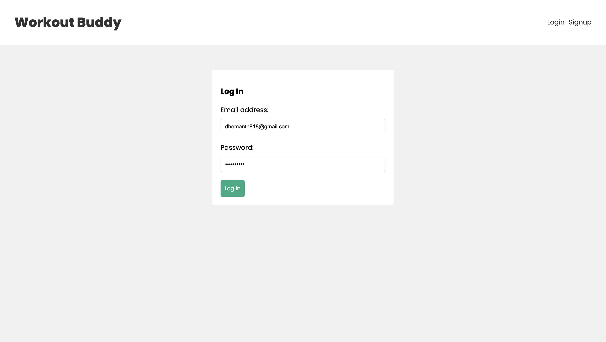
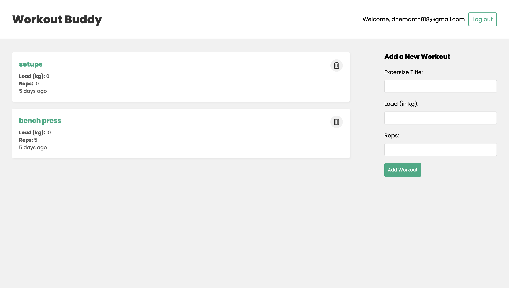

#  Workout Plans – MERN Stack Fitness Tracker

**Workout Plans** is a full-stack fitness tracking application built using the **MERN stack** — MongoDB, Express.js, React.js, and Node.js. It enables users to securely register, log in, and manage their daily workout routines with ease.

---

##  Features

-  User registration and login with **JWT authentication**
-  View a list of all workout entries
-  Add new workouts with details (title, load in kg, and reps)
-  delete existing workouts
-  Real-time UI updates on workout entry changes
-  RESTful API architecture
-  Responsive and clean user interface

---

##  Tech Stack

###  Frontend
- **React.js**
- **JSX** for component structure
- **React Hooks** (`useState`, `useEffect`)
- **React Router DOM**
- **Context API** for global state management

### 🖥 Backend
- **Node.js**
- **Express.js**
- **MongoDB** with **Mongoose**
- **JWT (JSON Web Tokens)** for authentication
- **Bcrypt.js** for password hashing
- **dotenv** for environment configuration
- **CORS**, **Morgan** for middleware

---

##  Folder Structure
```
MERN_Stack/
├── Backend/
│   ├── controllers/
│   │   ├── userController.js
│   │   └── workoutController.js
│   ├── middleware/
│   │   └── requireAuth.js
│   ├── Models/
│   │   ├── userModel.js
│   │   └── workoutModel.js
│   ├── routes/
│   │   ├── user.js
│   │   └── workouts.js
│   ├── .env
│   ├── .gitignore
│   ├── package.json
│   ├── package-lock.json
│   ├── server.js
│   └── vercel.json
├── frontend/
│   ├── node_modules/
│   ├── public/
│   └── src/
│       ├── components/
│       │   ├── Navbar.js
│       │   ├── WorkoutDetails.js
│       │   └── WorkoutForm.js
│       ├── context/
│       │   ├── AuthContext.js
│       │   └── WorkoutsContext.js
│       ├── hooks/
│       │   ├── useAuthContext.js
│       │   ├── useLogin.js
│       │   ├── useLogout.js
│       │   ├── useSignup.js
│       │   └── useWorkoutsContext.js
│       ├── pages/
│       │   ├── Home.js
│       │   ├── Login.js
│       │   └── Signup.js
│       ├── App.js
│       ├── index.css
│       └── index.js
├── .gitignore
├── package.json
└── package-lock.json

```

---

##  Authentication

- JWT is used for generating and verifying user tokens.
- Protected routes ensure only authenticated users can access/modify workout data.
- Passwords are securely hashed using **Bcrypt.js** before being stored.

---

##  API Endpoints

| Method | Endpoint             | Description             |
|--------|----------------------|-------------------------|
| POST   | `/api/user/signup`   | Register a new user     |
| POST   | `/api/user/login`    | Login existing user     |
| GET    | `/api/workouts`      | Get all workouts        |
| POST   | `/api/workouts`      | Create a new workout    |
| DELETE | `/api/workouts/:id`  | Delete a workout        |
| PATCH  | `/api/workouts/:id`  | Update a workout        |

---
## 📸 Screenshots

### 🔐 Login Page
Shows the user login form with email and password authentication.



---

### 🏋️ Dashboard Page
Displays all workouts, user welcome message, and the "Add Workout" form.


